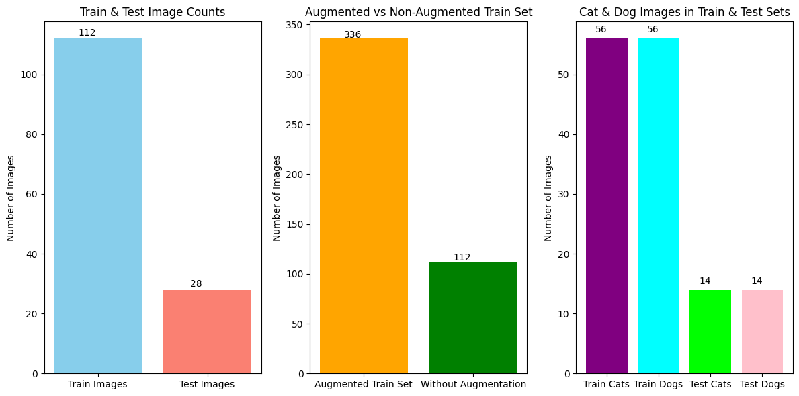
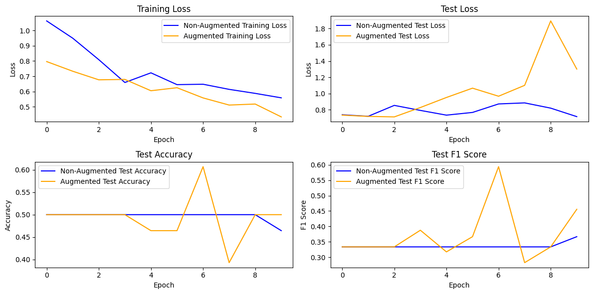

**GROUP 28**

Laksh Jain - 23110185

Tanish Yelgoe - 23110328

# TASK-1

For data augmentation, we randomly sample 3 augmentations from a set of 10 augmentations - rotation by 30 degrees, scale, saturation, blur, random-noise, colour jitter, pad square, pad, hflip and pixelization, and then apply the 3 augmentations on the image sequentially. We do this process twice for every image.

### IMAGE STATISTICS

Initially we have **112** images in train set and **28** images in test set. The number of images of cats and dogs is **EQUAL** in both train and test set.

For every image in train set, we apply augmentation function (on applying function once, the image is augmented thrice) 2 times. Hence, the number of augmented images is 112 * 2 = **224**. Hence, total number of images in train set is 112 + 224 = **336**.



# TASK-2

We load the resnet model from huggingface. Below is the architecture of the resnet model.


We load the pre-trained weights of the model, and define 2 models: **model_non_aug** and **model_aug** with the **SAME** weights.

```python
# Get the configuration from the Hugging Face hub.
config = ResNetConfig.from_pretrained("microsoft/resnet-50", num_labels=num_classes)

# Initialize a model with new (random) weights.
model_init = ResNetForImageClassification(config)
# Save the initial state dict.
initial_state_dict = copy.deepcopy(model_init.state_dict())

# Create two separate model instances and load the same initial weights.
model_non_aug = ResNetForImageClassification(config)
model_non_aug.load_state_dict(copy.deepcopy(initial_state_dict))

model_aug = ResNetForImageClassification(config)
model_aug.load_state_dict(copy.deepcopy(initial_state_dict))

# Move models to device.
device = torch.device("cuda" if torch.cuda.is_available() else "cpu")
model_non_aug.to(device)
model_aug.to(device)

```
The below is the information about the training parameters of the models.

<details>
<summary>Click to expand and view trainable parameters layer-wise</summary>
Layer: resnet.embedder.embedder.convolution.weight | Size: torch.Size([64, 3, 7, 7]) | Requires Grad: True
Layer: resnet.embedder.embedder.normalization.weight | Size: torch.Size([64]) | Requires Grad: True
Layer: resnet.embedder.embedder.normalization.bias | Size: torch.Size([64]) | Requires Grad: True
Layer: resnet.encoder.stages.0.layers.0.shortcut.convolution.weight | Size: torch.Size([256, 64, 1, 1]) | Requires Grad: True
Layer: resnet.encoder.stages.0.layers.0.shortcut.normalization.weight | Size: torch.Size([256]) | Requires Grad: True
Layer: resnet.encoder.stages.0.layers.0.shortcut.normalization.bias | Size: torch.Size([256]) | Requires Grad: True
Layer: resnet.encoder.stages.0.layers.0.layer.0.convolution.weight | Size: torch.Size([64, 64, 1, 1]) | Requires Grad: True
Layer: resnet.encoder.stages.0.layers.0.layer.0.normalization.weight | Size: torch.Size([64]) | Requires Grad: True
Layer: resnet.encoder.stages.0.layers.0.layer.0.normalization.bias | Size: torch.Size([64]) | Requires Grad: True
Layer: resnet.encoder.stages.0.layers.0.layer.1.convolution.weight | Size: torch.Size([64, 64, 3, 3]) | Requires Grad: True
Layer: resnet.encoder.stages.0.layers.0.layer.1.normalization.weight | Size: torch.Size([64]) | Requires Grad: True
Layer: resnet.encoder.stages.0.layers.0.layer.1.normalization.bias | Size: torch.Size([64]) | Requires Grad: True
Layer: resnet.encoder.stages.0.layers.0.layer.2.convolution.weight | Size: torch.Size([256, 64, 1, 1]) | Requires Grad: True
Layer: resnet.encoder.stages.0.layers.0.layer.2.normalization.weight | Size: torch.Size([256]) | Requires Grad: True
Layer: resnet.encoder.stages.0.layers.0.layer.2.normalization.bias | Size: torch.Size([256]) | Requires Grad: True
Layer: resnet.encoder.stages.0.layers.1.layer.0.convolution.weight | Size: torch.Size([64, 256, 1, 1]) | Requires Grad: True
Layer: resnet.encoder.stages.0.layers.1.layer.0.normalization.weight | Size: torch.Size([64]) | Requires Grad: True
Layer: resnet.encoder.stages.0.layers.1.layer.0.normalization.bias | Size: torch.Size([64]) | Requires Grad: True
Layer: resnet.encoder.stages.0.layers.1.layer.1.convolution.weight | Size: torch.Size([64, 64, 3, 3]) | Requires Grad: True
Layer: resnet.encoder.stages.0.layers.1.layer.1.normalization.weight | Size: torch.Size([64]) | Requires Grad: True
Layer: resnet.encoder.stages.0.layers.1.layer.1.normalization.bias | Size: torch.Size([64]) | Requires Grad: True
Layer: resnet.encoder.stages.0.layers.1.layer.2.convolution.weight | Size: torch.Size([256, 64, 1, 1]) | Requires Grad: True
Layer: resnet.encoder.stages.0.layers.1.layer.2.normalization.weight | Size: torch.Size([256]) | Requires Grad: True
Layer: resnet.encoder.stages.0.layers.1.layer.2.normalization.bias | Size: torch.Size([256]) | Requires Grad: True
Layer: resnet.encoder.stages.0.layers.2.layer.0.convolution.weight | Size: torch.Size([64, 256, 1, 1]) | Requires Grad: True
Layer: resnet.encoder.stages.0.layers.2.layer.0.normalization.weight | Size: torch.Size([64]) | Requires Grad: True
Layer: resnet.encoder.stages.0.layers.2.layer.0.normalization.bias | Size: torch.Size([64]) | Requires Grad: True
Layer: resnet.encoder.stages.0.layers.2.layer.1.convolution.weight | Size: torch.Size([64, 64, 3, 3]) | Requires Grad: True
Layer: resnet.encoder.stages.0.layers.2.layer.1.normalization.weight | Size: torch.Size([64]) | Requires Grad: True
Layer: resnet.encoder.stages.0.layers.2.layer.1.normalization.bias | Size: torch.Size([64]) | Requires Grad: True
Layer: resnet.encoder.stages.0.layers.2.layer.2.convolution.weight | Size: torch.Size([256, 64, 1, 1]) | Requires Grad: True
Layer: resnet.encoder.stages.0.layers.2.layer.2.normalization.weight | Size: torch.Size([256]) | Requires Grad: True
Layer: resnet.encoder.stages.0.layers.2.layer.2.normalization.bias | Size: torch.Size([256]) | Requires Grad: True
Layer: resnet.encoder.stages.1.layers.0.shortcut.convolution.weight | Size: torch.Size([512, 256, 1, 1]) | Requires Grad: True
Layer: resnet.encoder.stages.1.layers.0.shortcut.normalization.weight | Size: torch.Size([512]) | Requires Grad: True
Layer: resnet.encoder.stages.1.layers.0.shortcut.normalization.bias | Size: torch.Size([512]) | Requires Grad: True
Layer: resnet.encoder.stages.1.layers.0.layer.0.convolution.weight | Size: torch.Size([128, 256, 1, 1]) | Requires Grad: True
Layer: resnet.encoder.stages.1.layers.0.layer.0.normalization.weight | Size: torch.Size([128]) | Requires Grad: True
Layer: resnet.encoder.stages.1.layers.0.layer.0.normalization.bias | Size: torch.Size([128]) | Requires Grad: True
Layer: resnet.encoder.stages.1.layers.0.layer.1.convolution.weight | Size: torch.Size([128, 128, 3, 3]) | Requires Grad: True
Layer: resnet.encoder.stages.1.layers.0.layer.1.normalization.weight | Size: torch.Size([128]) | Requires Grad: True
Layer: resnet.encoder.stages.1.layers.0.layer.1.normalization.bias | Size: torch.Size([128]) | Requires Grad: True
Layer: resnet.encoder.stages.1.layers.0.layer.2.convolution.weight | Size: torch.Size([512, 128, 1, 1]) | Requires Grad: True
Layer: resnet.encoder.stages.1.layers.0.layer.2.normalization.weight | Size: torch.Size([512]) | Requires Grad: True
Layer: resnet.encoder.stages.1.layers.0.layer.2.normalization.bias | Size: torch.Size([512]) | Requires Grad: True
Layer: resnet.encoder.stages.1.layers.1.layer.0.convolution.weight | Size: torch.Size([128, 512, 1, 1]) | Requires Grad: True
Layer: resnet.encoder.stages.1.layers.1.layer.0.normalization.weight | Size: torch.Size([128]) | Requires Grad: True
Layer: resnet.encoder.stages.1.layers.1.layer.0.normalization.bias | Size: torch.Size([128]) | Requires Grad: True
Layer: resnet.encoder.stages.1.layers.1.layer.1.convolution.weight | Size: torch.Size([128, 128, 3, 3]) | Requires Grad: True
Layer: resnet.encoder.stages.1.layers.1.layer.1.normalization.weight | Size: torch.Size([128]) | Requires Grad: True
Layer: resnet.encoder.stages.1.layers.1.layer.1.normalization.bias | Size: torch.Size([128]) | Requires Grad: True
Layer: resnet.encoder.stages.1.layers.1.layer.2.convolution.weight | Size: torch.Size([512, 128, 1, 1]) | Requires Grad: True
Layer: resnet.encoder.stages.1.layers.1.layer.2.normalization.weight | Size: torch.Size([512]) | Requires Grad: True
Layer: resnet.encoder.stages.1.layers.1.layer.2.normalization.bias | Size: torch.Size([512]) | Requires Grad: True
Layer: resnet.encoder.stages.1.layers.2.layer.0.convolution.weight | Size: torch.Size([128, 512, 1, 1]) | Requires Grad: True
Layer: resnet.encoder.stages.1.layers.2.layer.0.normalization.weight | Size: torch.Size([128]) | Requires Grad: True
Layer: resnet.encoder.stages.1.layers.2.layer.0.normalization.bias | Size: torch.Size([128]) | Requires Grad: True
Layer: resnet.encoder.stages.1.layers.2.layer.1.convolution.weight | Size: torch.Size([128, 128, 3, 3]) | Requires Grad: True
Layer: resnet.encoder.stages.1.layers.2.layer.1.normalization.weight | Size: torch.Size([128]) | Requires Grad: True
Layer: resnet.encoder.stages.1.layers.2.layer.1.normalization.bias | Size: torch.Size([128]) | Requires Grad: True
Layer: resnet.encoder.stages.1.layers.2.layer.2.convolution.weight | Size: torch.Size([512, 128, 1, 1]) | Requires Grad: True
Layer: resnet.encoder.stages.1.layers.2.layer.2.normalization.weight | Size: torch.Size([512]) | Requires Grad: True
Layer: resnet.encoder.stages.1.layers.2.layer.2.normalization.bias | Size: torch.Size([512]) | Requires Grad: True
Layer: resnet.encoder.stages.1.layers.3.layer.0.convolution.weight | Size: torch.Size([128, 512, 1, 1]) | Requires Grad: True
Layer: resnet.encoder.stages.1.layers.3.layer.0.normalization.weight | Size: torch.Size([128]) | Requires Grad: True
Layer: resnet.encoder.stages.1.layers.3.layer.0.normalization.bias | Size: torch.Size([128]) | Requires Grad: True
Layer: resnet.encoder.stages.1.layers.3.layer.1.convolution.weight | Size: torch.Size([128, 128, 3, 3]) | Requires Grad: True
Layer: resnet.encoder.stages.1.layers.3.layer.1.normalization.weight | Size: torch.Size([128]) | Requires Grad: True
Layer: resnet.encoder.stages.1.layers.3.layer.1.normalization.bias | Size: torch.Size([128]) | Requires Grad: True
Layer: resnet.encoder.stages.1.layers.3.layer.2.convolution.weight | Size: torch.Size([512, 128, 1, 1]) | Requires Grad: True
Layer: resnet.encoder.stages.1.layers.3.layer.2.normalization.weight | Size: torch.Size([512]) | Requires Grad: True
Layer: resnet.encoder.stages.1.layers.3.layer.2.normalization.bias | Size: torch.Size([512]) | Requires Grad: True
Layer: resnet.encoder.stages.2.layers.0.shortcut.convolution.weight | Size: torch.Size([1024, 512, 1, 1]) | Requires Grad: True
Layer: resnet.encoder.stages.2.layers.0.shortcut.normalization.weight | Size: torch.Size([1024]) | Requires Grad: True
Layer: resnet.encoder.stages.2.layers.0.shortcut.normalization.bias | Size: torch.Size([1024]) | Requires Grad: True
Layer: resnet.encoder.stages.2.layers.0.layer.0.convolution.weight | Size: torch.Size([256, 512, 1, 1]) | Requires Grad: True
Layer: resnet.encoder.stages.2.layers.0.layer.0.normalization.weight | Size: torch.Size([256]) | Requires Grad: True
Layer: resnet.encoder.stages.2.layers.0.layer.0.normalization.bias | Size: torch.Size([256]) | Requires Grad: True
Layer: resnet.encoder.stages.2.layers.0.layer.1.convolution.weight | Size: torch.Size([256, 256, 3, 3]) | Requires Grad: True
Layer: resnet.encoder.stages.2.layers.0.layer.1.normalization.weight | Size: torch.Size([256]) | Requires Grad: True
Layer: resnet.encoder.stages.2.layers.0.layer.1.normalization.bias | Size: torch.Size([256]) | Requires Grad: True
Layer: resnet.encoder.stages.2.layers.0.layer.2.convolution.weight | Size: torch.Size([1024, 256, 1, 1]) | Requires Grad: True
Layer: resnet.encoder.stages.2.layers.0.layer.2.normalization.weight | Size: torch.Size([1024]) | Requires Grad: True
Layer: resnet.encoder.stages.2.layers.0.layer.2.normalization.bias | Size: torch.Size([1024]) | Requires Grad: True
Layer: resnet.encoder.stages.2.layers.1.layer.0.convolution.weight | Size: torch.Size([256, 1024, 1, 1]) | Requires Grad: True
Layer: resnet.encoder.stages.2.layers.1.layer.0.normalization.weight | Size: torch.Size([256]) | Requires Grad: True
Layer: resnet.encoder.stages.2.layers.1.layer.0.normalization.bias | Size: torch.Size([256]) | Requires Grad: True
Layer: resnet.encoder.stages.2.layers.1.layer.1.convolution.weight | Size: torch.Size([256, 256, 3, 3]) | Requires Grad: True
Layer: resnet.encoder.stages.2.layers.1.layer.1.normalization.weight | Size: torch.Size([256]) | Requires Grad: True
Layer: resnet.encoder.stages.2.layers.1.layer.1.normalization.bias | Size: torch.Size([256]) | Requires Grad: True
Layer: resnet.encoder.stages.2.layers.1.layer.2.convolution.weight | Size: torch.Size([1024, 256, 1, 1]) | Requires Grad: True
Layer: resnet.encoder.stages.2.layers.1.layer.2.normalization.weight | Size: torch.Size([1024]) | Requires Grad: True
Layer: resnet.encoder.stages.2.layers.1.layer.2.normalization.bias | Size: torch.Size([1024]) | Requires Grad: True
Layer: resnet.encoder.stages.2.layers.2.layer.0.convolution.weight | Size: torch.Size([256, 1024, 1, 1]) | Requires Grad: True
Layer: resnet.encoder.stages.2.layers.2.layer.0.normalization.weight | Size: torch.Size([256]) | Requires Grad: True
Layer: resnet.encoder.stages.2.layers.2.layer.0.normalization.bias | Size: torch.Size([256]) | Requires Grad: True
Layer: resnet.encoder.stages.2.layers.2.layer.1.convolution.weight | Size: torch.Size([256, 256, 3, 3]) | Requires Grad: True
Layer: resnet.encoder.stages.2.layers.2.layer.1.normalization.weight | Size: torch.Size([256]) | Requires Grad: True
Layer: resnet.encoder.stages.2.layers.2.layer.1.normalization.bias | Size: torch.Size([256]) | Requires Grad: True
Layer: resnet.encoder.stages.2.layers.2.layer.2.convolution.weight | Size: torch.Size([1024, 256, 1, 1]) | Requires Grad: True
Layer: resnet.encoder.stages.2.layers.2.layer.2.normalization.weight | Size: torch.Size([1024]) | Requires Grad: True
Layer: resnet.encoder.stages.2.layers.2.layer.2.normalization.bias | Size: torch.Size([1024]) | Requires Grad: True
Layer: resnet.encoder.stages.2.layers.3.layer.0.convolution.weight | Size: torch.Size([256, 1024, 1, 1]) | Requires Grad: True
Layer: resnet.encoder.stages.2.layers.3.layer.0.normalization.weight | Size: torch.Size([256]) | Requires Grad: True
Layer: resnet.encoder.stages.2.layers.3.layer.0.normalization.bias | Size: torch.Size([256]) | Requires Grad: True
Layer: resnet.encoder.stages.2.layers.3.layer.1.convolution.weight | Size: torch.Size([256, 256, 3, 3]) | Requires Grad: True
Layer: resnet.encoder.stages.2.layers.3.layer.1.normalization.weight | Size: torch.Size([256]) | Requires Grad: True
Layer: resnet.encoder.stages.2.layers.3.layer.1.normalization.bias | Size: torch.Size([256]) | Requires Grad: True
Layer: resnet.encoder.stages.2.layers.3.layer.2.convolution.weight | Size: torch.Size([1024, 256, 1, 1]) | Requires Grad: True
Layer: resnet.encoder.stages.2.layers.3.layer.2.normalization.weight | Size: torch.Size([1024]) | Requires Grad: True
Layer: resnet.encoder.stages.2.layers.3.layer.2.normalization.bias | Size: torch.Size([1024]) | Requires Grad: True
Layer: resnet.encoder.stages.2.layers.4.layer.0.convolution.weight | Size: torch.Size([256, 1024, 1, 1]) | Requires Grad: True
Layer: resnet.encoder.stages.2.layers.4.layer.0.normalization.weight | Size: torch.Size([256]) | Requires Grad: True
Layer: resnet.encoder.stages.2.layers.4.layer.0.normalization.bias | Size: torch.Size([256]) | Requires Grad: True
Layer: resnet.encoder.stages.2.layers.4.layer.1.convolution.weight | Size: torch.Size([256, 256, 3, 3]) | Requires Grad: True
Layer: resnet.encoder.stages.2.layers.4.layer.1.normalization.weight | Size: torch.Size([256]) | Requires Grad: True
Layer: resnet.encoder.stages.2.layers.4.layer.1.normalization.bias | Size: torch.Size([256]) | Requires Grad: True
Layer: resnet.encoder.stages.2.layers.4.layer.2.convolution.weight | Size: torch.Size([1024, 256, 1, 1]) | Requires Grad: True
Layer: resnet.encoder.stages.2.layers.4.layer.2.normalization.weight | Size: torch.Size([1024]) | Requires Grad: True
Layer: resnet.encoder.stages.2.layers.4.layer.2.normalization.bias | Size: torch.Size([1024]) | Requires Grad: True
Layer: resnet.encoder.stages.2.layers.5.layer.0.convolution.weight | Size: torch.Size([256, 1024, 1, 1]) | Requires Grad: True
Layer: resnet.encoder.stages.2.layers.5.layer.0.normalization.weight | Size: torch.Size([256]) | Requires Grad: True
Layer: resnet.encoder.stages.2.layers.5.layer.0.normalization.bias | Size: torch.Size([256]) | Requires Grad: True
Layer: resnet.encoder.stages.2.layers.5.layer.1.convolution.weight | Size: torch.Size([256, 256, 3, 3]) | Requires Grad: True
Layer: resnet.encoder.stages.2.layers.5.layer.1.normalization.weight | Size: torch.Size([256]) | Requires Grad: True
Layer: resnet.encoder.stages.2.layers.5.layer.1.normalization.bias | Size: torch.Size([256]) | Requires Grad: True
Layer: resnet.encoder.stages.2.layers.5.layer.2.convolution.weight | Size: torch.Size([1024, 256, 1, 1]) | Requires Grad: True
Layer: resnet.encoder.stages.2.layers.5.layer.2.normalization.weight | Size: torch.Size([1024]) | Requires Grad: True
Layer: resnet.encoder.stages.2.layers.5.layer.2.normalization.bias | Size: torch.Size([1024]) | Requires Grad: True
Layer: resnet.encoder.stages.3.layers.0.shortcut.convolution.weight | Size: torch.Size([2048, 1024, 1, 1]) | Requires Grad: True
Layer: resnet.encoder.stages.3.layers.0.shortcut.normalization.weight | Size: torch.Size([2048]) | Requires Grad: True
Layer: resnet.encoder.stages.3.layers.0.shortcut.normalization.bias | Size: torch.Size([2048]) | Requires Grad: True
Layer: resnet.encoder.stages.3.layers.0.layer.0.convolution.weight | Size: torch.Size([512, 1024, 1, 1]) | Requires Grad: True
Layer: resnet.encoder.stages.3.layers.0.layer.0.normalization.weight | Size: torch.Size([512]) | Requires Grad: True
Layer: resnet.encoder.stages.3.layers.0.layer.0.normalization.bias | Size: torch.Size([512]) | Requires Grad: True
Layer: resnet.encoder.stages.3.layers.0.layer.1.convolution.weight | Size: torch.Size([512, 512, 3, 3]) | Requires Grad: True
Layer: resnet.encoder.stages.3.layers.0.layer.1.normalization.weight | Size: torch.Size([512]) | Requires Grad: True
Layer: resnet.encoder.stages.3.layers.0.layer.1.normalization.bias | Size: torch.Size([512]) | Requires Grad: True
Layer: resnet.encoder.stages.3.layers.0.layer.2.convolution.weight | Size: torch.Size([2048, 512, 1, 1]) | Requires Grad: True
Layer: resnet.encoder.stages.3.layers.0.layer.2.normalization.weight | Size: torch.Size([2048]) | Requires Grad: True
Layer: resnet.encoder.stages.3.layers.0.layer.2.normalization.bias | Size: torch.Size([2048]) | Requires Grad: True
Layer: resnet.encoder.stages.3.layers.1.layer.0.convolution.weight | Size: torch.Size([512, 2048, 1, 1]) | Requires Grad: True
Layer: resnet.encoder.stages.3.layers.1.layer.0.normalization.weight | Size: torch.Size([512]) | Requires Grad: True
Layer: resnet.encoder.stages.3.layers.1.layer.0.normalization.bias | Size: torch.Size([512]) | Requires Grad: True
Layer: resnet.encoder.stages.3.layers.1.layer.1.convolution.weight | Size: torch.Size([512, 512, 3, 3]) | Requires Grad: True
Layer: resnet.encoder.stages.3.layers.1.layer.1.normalization.weight | Size: torch.Size([512]) | Requires Grad: True
Layer: resnet.encoder.stages.3.layers.1.layer.1.normalization.bias | Size: torch.Size([512]) | Requires Grad: True
Layer: resnet.encoder.stages.3.layers.1.layer.2.convolution.weight | Size: torch.Size([2048, 512, 1, 1]) | Requires Grad: True
Layer: resnet.encoder.stages.3.layers.1.layer.2.normalization.weight | Size: torch.Size([2048]) | Requires Grad: True
Layer: resnet.encoder.stages.3.layers.1.layer.2.normalization.bias | Size: torch.Size([2048]) | Requires Grad: True
Layer: resnet.encoder.stages.3.layers.2.layer.0.convolution.weight | Size: torch.Size([512, 2048, 1, 1]) | Requires Grad: True
Layer: resnet.encoder.stages.3.layers.2.layer.0.normalization.weight | Size: torch.Size([512]) | Requires Grad: True
Layer: resnet.encoder.stages.3.layers.2.layer.0.normalization.bias | Size: torch.Size([512]) | Requires Grad: True
Layer: resnet.encoder.stages.3.layers.2.layer.1.convolution.weight | Size: torch.Size([512, 512, 3, 3]) | Requires Grad: True
Layer: resnet.encoder.stages.3.layers.2.layer.1.normalization.weight | Size: torch.Size([512]) | Requires Grad: True
Layer: resnet.encoder.stages.3.layers.2.layer.1.normalization.bias | Size: torch.Size([512]) | Requires Grad: True
Layer: resnet.encoder.stages.3.layers.2.layer.2.convolution.weight | Size: torch.Size([2048, 512, 1, 1]) | Requires Grad: True
Layer: resnet.encoder.stages.3.layers.2.layer.2.normalization.weight | Size: torch.Size([2048]) | Requires Grad: True
Layer: resnet.encoder.stages.3.layers.2.layer.2.normalization.bias | Size: torch.Size([2048]) | Requires Grad: True
Layer: classifier.1.weight | Size: torch.Size([2, 2048]) | Requires Grad: True
Layer: classifier.1.bias | Size: torch.Size([2]) | Requires Grad: True
</details>

The total number of parameters for both models is equal to **23512130**.

### EVALUATION METRICS

```python
----- Training model on non-augmented data -----
[Non-Aug] Epoch 1/10, Loss: 1.0629
[Non-Aug] Epoch 2/10, Loss: 0.9497
[Non-Aug] Epoch 3/10, Loss: 0.8087
[Non-Aug] Epoch 4/10, Loss: 0.6591
[Non-Aug] Epoch 5/10, Loss: 0.7224
[Non-Aug] Epoch 6/10, Loss: 0.6450
[Non-Aug] Epoch 7/10, Loss: 0.6476
[Non-Aug] Epoch 8/10, Loss: 0.6140
[Non-Aug] Epoch 9/10, Loss: 0.5877
[Non-Aug] Epoch 10/10, Loss: 0.5584

Non-Augmented Model Metrics on Test Set:
Accuracy:  0.4643
Precision: 0.4067
Recall:    0.4643
F1 Score:  0.3665

----- Training model on augmented data -----
[Augmented] Epoch 1/10, Loss: 0.7963
[Augmented] Epoch 2/10, Loss: 0.7329
[Augmented] Epoch 3/10, Loss: 0.6766
[Augmented] Epoch 4/10, Loss: 0.6792
[Augmented] Epoch 5/10, Loss: 0.6050
[Augmented] Epoch 6/10, Loss: 0.6248
[Augmented] Epoch 7/10, Loss: 0.5579
[Augmented] Epoch 8/10, Loss: 0.5110
[Augmented] Epoch 9/10, Loss: 0.5177
[Augmented] Epoch 10/10, Loss: 0.4334

Augmented Model Metrics on Test Set:
Accuracy:  0.5000
Precision: 0.5000
Recall:    0.5000
F1 Score:  0.4556
```

The plots for the metrics when training epoch wise are given below:



### RESULT ANALYSIS

The model which was trained on augmented images gives better performance on the test data. This is because data augmentation increases the diversity of training examples, helping the model generalize better to unseen data. It prevents overfitting by exposing the model to different variations of the data, such as rotated, flipped, or scaled images, which enhances its robustness and ability to recognize patterns in a variety of conditions.

Data augmentation is also good when we have limited amount of train data as we get a diverse and increased dataset.
